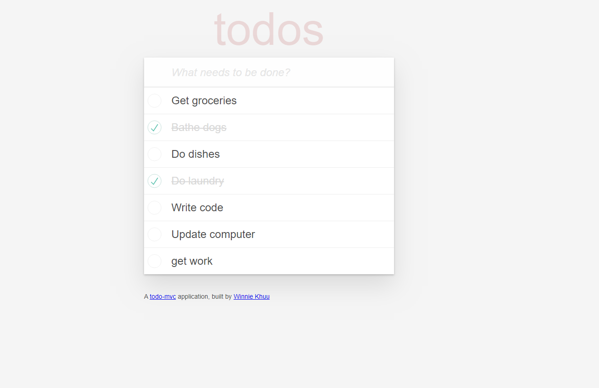

# README

Todo is a single page application that uses RESTful API (<b>RE</b>presentational <b>S</b>tate <b>T</b>ransfer <b>A</b>pplication <b>P</b>rogram <b>I</b>nterface).
A RESTful API uses HTTP requests to GET, PUT, POST, and DELETE data.

See it in action <a href="https://todo-winnie-khuu.herokuapp.com">here</a>.

## TECHNOLOGIES USED
* HTML
* CSS
* JavaScript
* Ruby
* Rails
* Algorithms
* Vagrant
* PuTTY
* RubyMine

## SEE IT LOCALLY

1. Download the repository and unzip the files.
2. In your preferred coding environment, navigate to the folder `cd XXXXX/todo-master`
3. Run `bundle install` to install the required Ruby gems.
3. Run `rake db:create db: migrate` to set up the database.
4. Visit your localhost link (i.e. localhost:3030 or localhost:3000)

## SCREENSHOT

Single page application to do list
